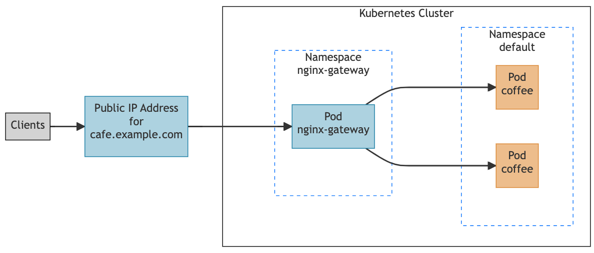
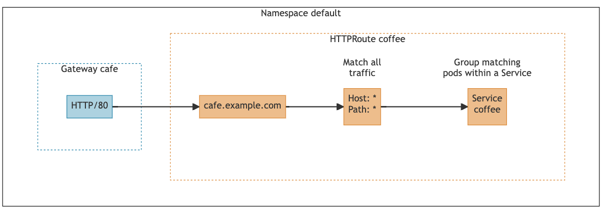

# 服务网关

采用K8s原生[Gateway](https://kubernetes.io/zh-cn/docs/concepts/services-networking/gateway/)

## 安装网关

[nginx-gateway-fabric](https://docs.nginx.com/nginx-gateway-fabric/)

### Install the Gateway API resources

```sh
$ kubectl kustomize "https://github.com/nginxinc/nginx-gateway-fabric/config/crd/gateway-api/standard?ref=v1.3.0" | kubectl apply -f -
customresourcedefinition.apiextensions.k8s.io/gatewayclasses.gateway.networking.k8s.io created
customresourcedefinition.apiextensions.k8s.io/gateways.gateway.networking.k8s.io created
customresourcedefinition.apiextensions.k8s.io/grpcroutes.gateway.networking.k8s.io created
customresourcedefinition.apiextensions.k8s.io/httproutes.gateway.networking.k8s.io created
customresourcedefinition.apiextensions.k8s.io/referencegrants.gateway.networking.k8s.io created
```

确认CRD已经安装成功:
```sh
$ kubectl get crds | grep gateway
NAME                                        CREATED AT
gatewayclasses.gateway.networking.k8s.io    2024-06-16T03:42:18Z
gateways.gateway.networking.k8s.io          2024-06-16T03:42:18Z
grpcroutes.gateway.networking.k8s.io        2024-06-16T03:42:18Z
httproutes.gateway.networking.k8s.io        2024-06-16T03:42:18Z
referencegrants.gateway.networking.k8s.io   2024-06-16T03:42:18Z
```

###  Deploy the NGINX Gateway Fabric CRDs

```sh
$ kubectl apply -f https://raw.githubusercontent.com/nginxinc/nginx-gateway-fabric/v1.3.0/deploy/crds.yaml
customresourcedefinition.apiextensions.k8s.io/clientsettingspolicies.gateway.nginx.org created
customresourcedefinition.apiextensions.k8s.io/nginxgateways.gateway.nginx.org created
customresourcedefinition.apiextensions.k8s.io/nginxproxies.gateway.nginx.org created
customresourcedefinition.apiextensions.k8s.io/observabilitypolicies.gateway.nginx.org created
```

确认CRD已经安装成功:
```sh
$ kubectl get crds | grep nginx
clientsettingspolicies.gateway.nginx.org    2024-06-16T03:49:37Z
nginxgateways.gateway.nginx.org             2024-06-16T03:49:37Z
nginxproxies.gateway.nginx.org              2024-06-16T03:49:37Z
observabilitypolicies.gateway.nginx.org     2024-06-16T03:49:37Z
```

### Deploy NGINX Gateway Fabric

提前拉却镜像:
```sh
docker pull ghcr.io/nginxinc/nginx-gateway-fabric:1.3.0
docker pull ghcr.io/nginxinc/nginx-gateway-fabric/nginx:1.3.0
```

创建部署
```sh
$ kubectl apply -f https://github.com/nginxinc/nginx-gateway-fabric/releases/download/v1.3.0/nginx-gateway.yaml
namespace/nginx-gateway created
serviceaccount/nginx-gateway created
clusterrole.rbac.authorization.k8s.io/nginx-gateway created
clusterrolebinding.rbac.authorization.k8s.io/nginx-gateway created
deployment.apps/nginx-gateway created
gatewayclass.gateway.networking.k8s.io/nginx created
nginxgateway.gateway.nginx.org/nginx-gateway-config created
```

确认部署已经运行:
```sh
$ kubectl get pods -n nginx-gateway 
NAME                             READY   STATUS    RESTARTS        AGE
nginx-gateway-5d49f68457-hj98x   2/2     Running   1 (7m27s ago)   7m38s
```


### Expose NGINX Gateway Fabric

1. Create a NodePort service
```sh
kubectl apply -f https://raw.githubusercontent.com/nginxinc/nginx-gateway-fabric/v1.3.0/deploy/manifests/service/nodeport.yaml
```

2. 确认service已经创建成功
```sh
kubectl get svc nginx-gateway -n nginx-gateway

NAME            TYPE       CLUSTER-IP      EXTERNAL-IP   PORT(S)                      AGE
nginx-gateway   NodePort   10.104.170.23   <none>        80:31146/TCP,443:30140/TCP   65s
```

3. 确认NodePort端口能访问成功
```sh
$ curl localhost:31146
curl: (52) Empty reply from server
$ curl localhost:30140
curl: (52) Empty reply from server
```

## 网关使用



### Create the Gateway API resources

Gateway 用来描述流量处理基础设施的一个实例, 也就是我们刚才安装的 NGINX Gateway Fabric(你也可以选择其他实现)

创建一个名为cafe的 Nginx类型的网关(网关描述信息)
```sh
kubectl apply -f - <<EOF
apiVersion: gateway.networking.k8s.io/v1
kind: Gateway
metadata:
  name: cafe
spec:
  gatewayClassName: nginx
  listeners:
  - name: http
    port: 80
    protocol: HTTP
EOF
```

确认网关已经创建
```sh
$ kubectl get gateway
NAME   CLASS   ADDRESS   PROGRAMMED   AGE
cafe   nginx             True         6s
$ kubectl describe gateway cafe
...
```

### Create the coffee application

```yaml
kubectl apply -f - <<EOF
apiVersion: apps/v1
kind: Deployment
metadata:
  name: coffee
spec:
  replicas: 1
  selector:
    matchLabels:
      app: coffee
  template:
    metadata:
      labels:
        app: coffee
    spec:
      containers:
      - name: coffee
        image: kennethreitz/httpbin
        ports:
        - containerPort: 80
---
apiVersion: v1
kind: Service
metadata:
  name: coffee
spec:
  ports:
  - port: 80
    targetPort: 80
    protocol: TCP
    name: http
  selector:
    app: coffee
EOF
```

```sh
$ kubectl get po,svc | grep coffee            
pod/coffee-6bfcb6dc5f-gl92m           1/1     Running     0               84s
service/coffee            ClusterIP   10.103.207.208   <none>        80/TCP      84s
```

### Routing Traffic to Your Application



```yaml
kubectl apply -f - <<EOF
apiVersion: gateway.networking.k8s.io/v1
kind: HTTPRoute
metadata:
  name: coffee
spec:
  parentRefs:
  - name: cafe
  hostnames:
  - "cafe.example.com"
  rules:
  - matches:
    - path:
        type: PathPrefix
        value: /
    backendRefs:
    - name: coffee
      port: 80
EOF
```

```sh
$ kubectl get httproute
NAME     HOSTNAMES              AGE
coffee   ["cafe.example.com"]   9s
```

```sh
curl --location --request GET "localhost:31146/get?foo1=bar1&foo2=bar2" -H "Host: cafe.example.com"
{
  "args": {
    "foo1": "bar1", 
    "foo2": "bar2"
  }, 
  "headers": {
    "Accept": "*/*", 
    "Connection": "close", 
    "Host": "cafe.example.com", 
    "User-Agent": "curl/8.6.0"
  }, 
  "origin": "192.168.65.3", 
  "url": "http://cafe.example.com/get?foo1=bar1&foo2=bar2"
}
```

## 参考

+ [K8s Gateway Api Implementations](https://gateway-api.sigs.k8s.io/implementations/)
+ [腾讯云 LB 直通 Pod](https://www.shuzhiduo.com/A/lk5a1xPo51/)
+ [Configuring Ingress with Kubernetes Gateway API](https://apisix.apache.org/docs/ingress-controller/tutorials/configure-ingress-with-gateway-api/)